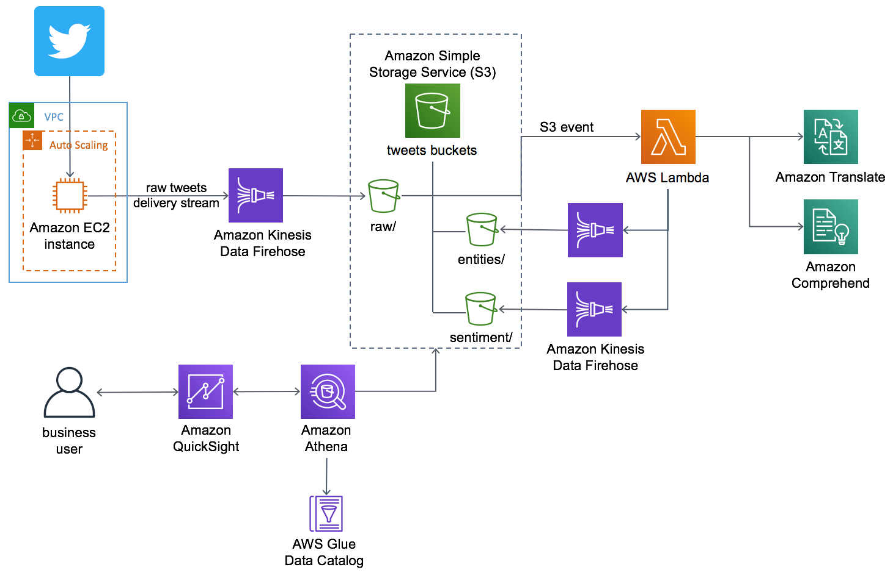

# Voice of the Customer (VoC)

**Voice of the Customer (VoC)*** to enhance customer experience with serverless architecture and sentiment analysis, using Amazon Kinesis, Amazon Athena, Amazon QuickSight, Amazon Comprehend, and ChatGPT-LLMs for sentiment analysis.

WIP ==> 

**AI-Driven Social Media Dashboard** is a complete web application that provides Voice of Customer Analytics through Social Media: Build a Social Media Dashboard using Artificial Intelligence and Business Intelligence Services including end-to-end testing, Serverless (Lambda, API-Gateway), Data Lake (Glue, Athena, Quicksight) and CI/CD. 

**Organizations want to understand how Customers perceive them and who those Customers are**. For example, what factors are driving the most positive and negative experiences for their offerings? Social Media interactions between Organizations and Customers are a great way to evaluate this and deepen brand awareness. Understanding these conversations are a low-cost way to acquire Leads, improve Website traffic, develop Customer Relationships, and improve Customer Service. Since these conversations are all in unstructured text format, it is difficult to scale the analysis and get the full picture.

For more up-to-date information on what's being implemented, take a look at our current [Social Listening Boards](https://github.com/nnthanh101/social-listening/projects/1).

To get started with the Social Listening application, you can deploy into your AWS Account by following our [Implementation Guide](./AI-Driven.md)

## 1. Social Listening - Deliverables

* [x] **Project Overview**: Social Listening and Business Intelligent Dasdboard for Business Users --> Severless Data Lake on AWS
* [x] **High-Level Architecture**: Infrastructure as Code & Serverless Data Lake
* [x] **Live Demo**: [QuickSight Mobile](https://aws.amazon.com/blogs/big-data/announcing-the-new-mobile-app-for-amazon-quicksight/), AWS Single Sign-On
* [x] **WAR - Well Architected Review**: Security, Reliability, Cost Optimization
* [x] Modern App [Amazon ECS Fargate](https://ecs-fargate.aws.job4u.io/)
* [x] Next Phase: End-to-end Solution with CI/CD pipeline, Click-Streams & Pinpoint integration, ...
* [ ] Lesson Learns & Improvements

> **Developer Content**
- [x] Serverless Data Lake:
    - [x] [AI-Driven Social Media Dashboard - Implementation Guide](./AI-Driven.md)
    - [x] [Serverless Data Lake on AWS](https://datalake.aws.job4u.io/)
- [x] [Amazon ECS Fargate](https://ecs-fargate.aws.job4u.io/)
  - [x]  [fargate-twitter-reader Docker](https://hub.docker.com/repository/docker/nnthanh101/fargate-twitter-reader)
- [x] Infrastructure as Code & Infrastructure is Code
    - [x] [Cloudformation](https://github.com/nnthanh101/social-listening/tree/master/deployment)
    - [ ] Terraform
    - [ ] CDK

## 2. High-Level Architecture



## 3. Environment Setup & Deployment

### 3.1. Deploy Bootstrap DOcker

```bash
./bootstrap.sh
```

* [ ] ECS/EKS Container - CI/CD pipeline

### 3.2. CDK - Infrastructure is Code

```
cd cdk-python/ServerlessWidgetService/

pip install -r requirements.txt    # Best to do this in a virtualenv

. ../../.env.sh                    # social-listening/.env.sh
cdk deploy                         # Deploys the CloudFormation template

## Afterwards
cdk destroy
```

### 3.3. Deploy fargate-twitter-reader on ECS Fargate

```bash
./bootstrap.sh
```

### 3.4. Building Lambda Package

```bash
cd deployment
./build-s3-dist.sh source-bucket-base-name version
```

source-bucket-base-name should be the base name for the S3 bucket location where the template will source the Lambda code from.
The template will append '-[region_name]' to this value.
version should be a version S3 key prefix
For example: ./build-s3-dist.sh solutions v1.0
The template will then expect the source code to be located in the solutions-[region_name]/ai-driven-social-media-dashboard/v1.0/

* [ ] Serverless (Lambda, API-Gateway) - CI/CD pipeline

### 3.4. Cloudformation template and Lambda function
Located in deployment/dist
